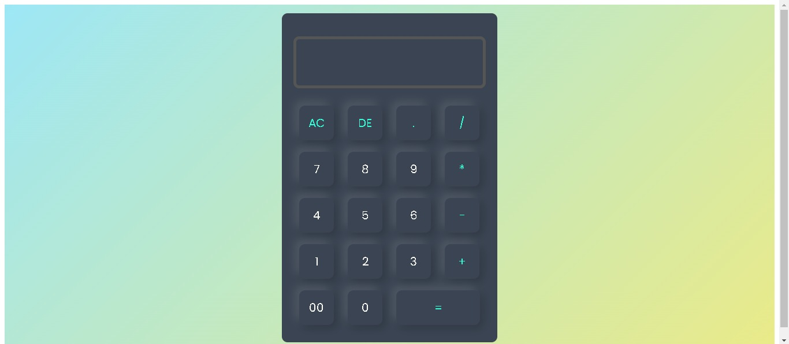
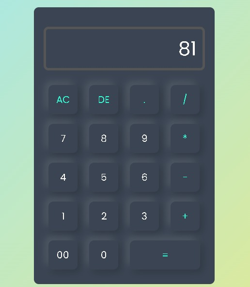

# **Simple_Calculator** 🧮

Welcome to **Simple Calculator** – a sleek and user-friendly calculator built with HTML and CSS. This project demonstrates a minimalist design with essential functionalities for quick and accurate calculations. Perfect for anyone looking for a straightforward and stylish calculator!





## **Features** ✨

- **Basic Arithmetic**: Perform addition, subtraction, multiplication, and division. ➕➖✖️➗
- **Responsive Design**: Accessible and functional on all device sizes. 📱💻
- **Clean Interface**: Simple and modern UI for a smooth user experience. 🎨
- **Easy to Use**: Intuitive layout with large buttons for efficient calculations. 🖱️

## **Tech Stack** 🔧

- **HTML**: Provides the structure and content of the calculator. 🏗️
- **CSS**: Styles the calculator with a modern, clean design. 🎨

## **Installation** 🚀

To use the Simple Calculator locally:

### **Clone the repository:**

```sh
git clone https://github.com/your-username/simple-calculator.git
```
**Navigate to the project directory**:
```sh
cd simple-calculator
```
**Open the application**:
**Open index.html in your preferred web browser to start using the calculator. 🌐**

## **Usage 📖**:
1. Open the Calculator: Launch index.html in your browser.
2. Perform Calculations: Use the number buttons and arithmetic operators to perform calculations.
3. Clear Input: Click the "C" button to clear the current input.
4. View Results: The result will be displayed on the screen after pressing the "=" button.

## **Contact 📧**:
**For any inquiries or suggestions, feel free to reach out**:
- Email: baksisrijita04@gmail.com
- github: https://github.com/SrijitaBaksi

**Thank you for exploring Simple Calculator! We hope you find it useful and easy to use. 😊**
